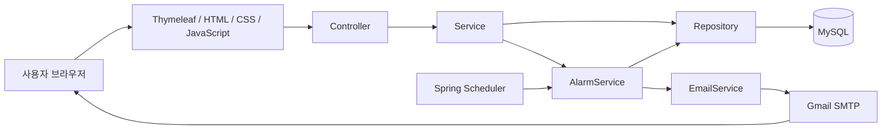

# 냉장고 식재료 유통기한 관리 서비스

가정 내 냉장고에 보관된 식재료를 등록하고 유통기한을 관리하며, 유통기한 7일 전 / 3일 전 / 당일에 이메일 알림을 제공하는 Spring Boot 기반 웹 서비스입니다.

## 주요 기능

- 회원가입, 로그인/로그아웃, 아이디·이메일 중복 확인
- 아이디 찾기 및 이메일 기반 비밀번호 안내
- 사용자별 여러 냉장고 등록·수정·삭제
- 냉장고별 식재료 등록·조회·수정·삭제
- 재료명 검색 및 유통기한 상태 표시
- 유통기한 기준 D-7 / D-3 / 당일 알림 일정 자동 생성
- 유통기한 수정 시 알림 날짜 재계산 및 발송 상태 초기화
- 이메일 발송 후 `is_sent_7`, `is_sent_3`, `is_sent_0` 상태 갱신을 통한 중복 발송 방지
- 사용자 이메일 알림 ON/OFF 설정

## 시스템 아키텍처



### 처리 흐름

1. 사용자가 냉장고와 식재료 정보를 등록합니다.
2. Controller가 요청을 받고 Service가 비즈니스 로직을 처리합니다.
3. Repository를 통해 MySQL에 사용자, 냉장고, 식재료 데이터를 저장합니다.
4. 식재료 등록 시 유통기한을 기준으로 7일 전, 3일 전, 당일 알림 날짜를 생성합니다.
5. 식재료의 유통기한을 수정하면 기존 알림 날짜를 다시 계산하고 발송 상태를 초기화합니다.
6. Scheduler가 알림 대상 날짜와 발송 상태를 확인합니다.
7. 조건이 충족되면 Gmail SMTP를 통해 이메일을 전송하고 발송 상태를 갱신합니다.

> 현재 저장소의 Scheduler cron은 보고서의 통합 테스트와 동일하게 매 분 실행하도록 설정되어 있습니다. 운영 환경에서는 `0 0 8 * * *`처럼 매일 오전 8시 실행으로 변경할 수 있습니다.

## 데이터 모델

| 테이블 | 역할 | 주요 컬럼 |
| --- | --- | --- |
| `users` | 사용자 정보 | user_id, username, password, name, email, email_notify |
| `fridge` | 사용자별 냉장고 정보 | fridge_id, user_id, fridge_name, fridge_type |
| `ingredient` | 냉장고별 식재료 정보 | ingredient_id, fridge_id, user_id, name, storage_type, category, quantity, expiration_date |
| `alarm` | 유통기한 알림 정보 | alarm_id, user_id, ingredient_id, alarm_date_7, alarm_date_3, alarm_date_0, is_sent_7, is_sent_3, is_sent_0 |

### 관계

- User 1 : N Fridge
- Fridge 1 : N Ingredient
- User 1 : N Ingredient
- Ingredient 1 : 1 Alarm 레코드에서 D-7 / D-3 / 당일 발송 상태를 각각 관리

## 기술 스택

| 구분 | 기술 |
| --- | --- |
| Language | Java 17 |
| Backend | Spring Boot 3.5.7, Spring Web MVC |
| View | Thymeleaf, HTML, CSS, JavaScript |
| Database | MySQL, Spring Data JPA |
| Mail | Spring Mail, Gmail SMTP |
| Build | Maven |
| Etc. | Lombok |

## 프로젝트 구조

```text
src
├── main
│   ├── java/com/example/dbserver
│   │   ├── controller
│   │   │   ├── UserController.java
│   │   │   ├── FridgeController.java
│   │   │   └── IngredientController.java
│   │   ├── entity
│   │   │   ├── User.java
│   │   │   ├── Fridge.java
│   │   │   ├── Ingredient.java
│   │   │   └── Alarm.java
│   │   ├── repository
│   │   │   ├── UserRepository.java
│   │   │   ├── FridgeRepository.java
│   │   │   ├── IngredientRepository.java
│   │   │   └── AlarmRepository.java
│   │   └── service
│   │       ├── UserService.java
│   │       ├── FridgeService.java
│   │       ├── IngredientService.java
│   │       ├── AlarmService.java
│   │       └── EmailService.java
│   └── resources
│       ├── static
│       ├── templates
│       └── application.properties.example
└── test
    └── java/com/example/dbserver/service
        └── AlarmServiceTest.java
```

## 커밋 컨벤션

GCS_Project와 동일하게 한글 대괄호 태그 기반 커밋 메시지를 사용합니다.

```text
[태그] 변경 내용
```

| 태그 | 용도 |
| --- | --- |
| `[초기설정]` | 프로젝트 구조, 빌드 및 환경 설정 |
| `[기능]` | 새로운 기능 또는 화면 구현 |
| `[수정]` | 오류 수정 및 기존 동작 개선 |
| `[리팩토링]` | 동작 변경 없이 코드 구조 개선 |
| `[테스트]` | 테스트 추가 및 검증 |
| `[문서]` | README 및 문서 수정 |
| `[병합]` | 브랜치 병합 및 통합 작업 |

예시:

```text
[기능] 식재료 등록·조회·수정·삭제 기능 구현
[기능] 스케줄러 기반 유통기한 이메일 알림 기능 구현
[수정] 식재료 삭제 시 연결된 알림 데이터 함께 정리
[문서] README 및 시스템 아키텍처 정리
```

## 실행 방법

### 1. 준비

- JDK 17
- Maven
- MySQL Server
- Gmail 앱 비밀번호

### 2. 환경 설정

`src/main/resources/application.properties.example`을 복사하여 `application.properties`를 생성합니다.

```bash
cp src/main/resources/application.properties.example src/main/resources/application.properties
```

이후 다음 값을 자신의 환경에 맞게 수정합니다.

```properties
spring.datasource.username=YOUR_DB_USERNAME
spring.datasource.password=YOUR_DB_PASSWORD
spring.mail.username=YOUR_GMAIL_ADDRESS
spring.mail.password=YOUR_GMAIL_APP_PASSWORD
```

> `application.properties`는 `.gitignore`에 등록되어 있습니다. DB 비밀번호나 Gmail 앱 비밀번호 같은 민감 정보는 저장소에 커밋하지 않습니다.

### 3. 실행

```bash
mvn spring-boot:run
```

기본 주소는 `http://localhost:8080`입니다.

## Contributors

| 이름 | 담당 역할 |
| --- | --- |
| 손수영 | DB 설계 및 구축, 서버 로직 구현 및 연동 |
| 정승화 | UI 제작 및 기능 구현 |

## License

개인 학습 및 포트폴리오 목적으로 진행한 프로젝트입니다.
